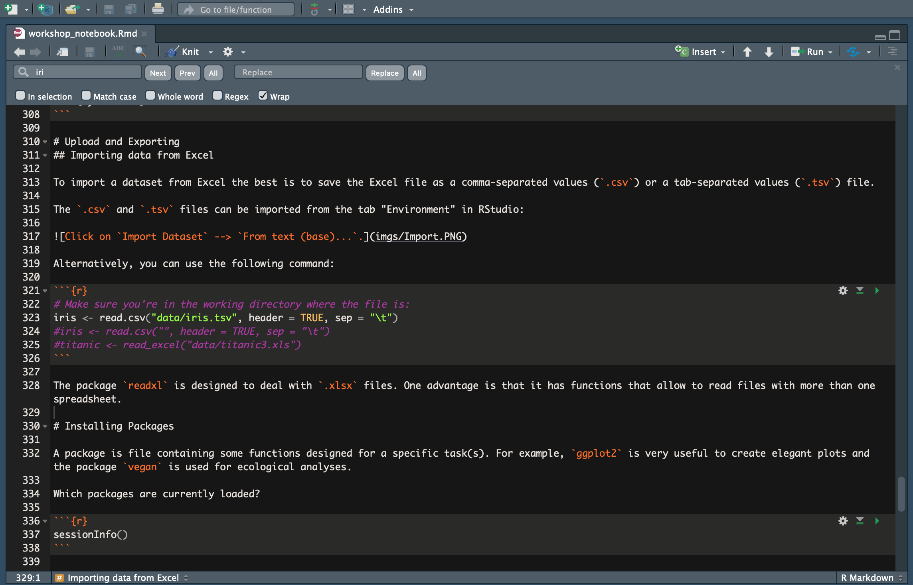
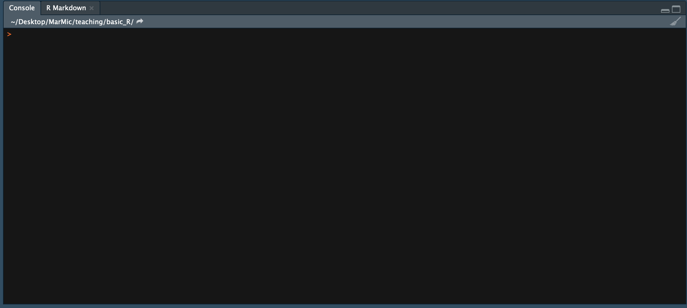
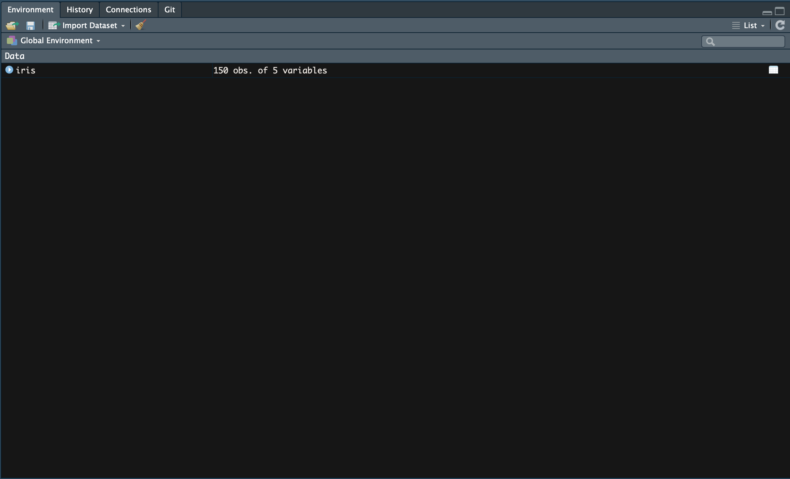
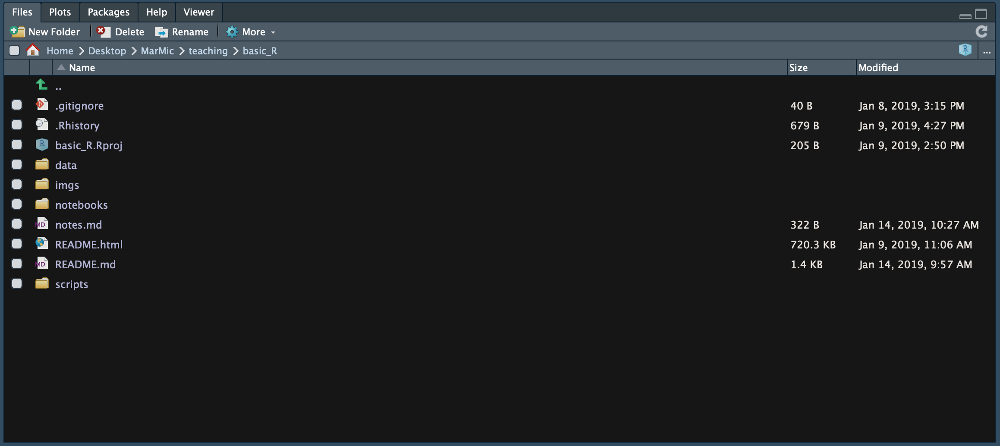

Ok, before we start, please run the code below to download a few packages for the course :)

```
install.packages("tidyverse")
```


# Why R?
***

R is a programming language and free software environment for statistical computing and graphics supported by the R Foundation for Statistical Computing. The R language is widely used among statisticians and data miners for developing statistical software and data analysis. [Wikipedia](https://en.wikipedia.org/wiki/R_(programming_language))

In summary:

* R is free
* R is multi-platform (Windows, GNU-Linux, MacOSX)
* R has a great help system
* R has a lot of pre-installed statistical functions
* The user can create and apply their own functions in R
* R makes data analyses **reproducible**
* Great online community (i.e. [Stack Overflow](https://stackoverflow.com/questions/tagged/r), [#rstats](https://twitter.com/search?q=%23rstats&src=typd))
* Very popular among biologists

Here are some great open source resources for your references:

- [R for Data Science](https://r4ds.had.co.nz/)
- [Advanced R](http://adv-r.had.co.nz/)
- [Fundamentals of Data Visualization](https://serialmentor.com/dataviz/)
- [blogdown: Creating Websites with R Markdown](https://bookdown.org/yihui/blogdown/)
- [RStudio cheatsheets](https://www.rstudio.com/resources/cheatsheets/)

# General tips for learning R programming
***

* **Google is your friend!** All levels of programmers search the web for solutions to coding problems. As you continue to develope your R skills you will also develope an intuition to search for solutions faster.
* **Organize** your data, images, scripts, and notebooks into separate directories. You have a lot of worry about... the more organized you are better.
* **Comment your code!** Try to consistenly write notes within your code to explain what you are doing and your results. If you don't, you WILL forget when you come back to it in the future. "Damn you, past self!"
* Stay positive and have fun :)

# Downloading R and RStudio
***

R versions can be downloaded from the [Comprehensive R Archive Network website](https://cran.r-project.org/). RStudio can be downloaded from the [website](https://www.rstudio.com/products/rstudio/download/).


# RStudio interface
***

### 1. Script window


### 2. Console


### 3. Environment. Where data objects/R objects are stored


### 4. Plot/Help/etc window


# Introduction to R programming language
***

We are getting into the exciting stuff! Open RStudio and start a new R script. This is like a text file where we will write and execute our commands.

## Intro

When writing R code, using hashtags (#) to include comments is highly recommended to make the notes understandable. Example:


```r
print("Hello") # This command prints an initial greeting :)
```

```
## [1] "Hello"
```

## How to get help

Use `?` to read the help page of functions or data sets. For example:

`?R.version`

or 

`help(R.Version)`

The [RStudio cheatsheets](https://www.rstudio.com/resources/cheatsheets/) are a great resource.

Also check [Stack Overflow](https://stackoverflow.com/questions/tagged/r) frequently :)

## Object names

To assign an object to a name we use `<-` (equivalent to `=`). The typing shortcut is `Cntr` + `-`. Names...

* ... are case sensitive
* ... can contain letters, numbers, "." and "_". They should start with a letter.
* ... should not have function or operator names: `function`, `if`, `c`...

Example:


```r
Greeting <- "Hello world!"

Greeting
```

```
## [1] "Hello world!"
```

## Data objects

There are the following types of objects:

* **Vectors**
* **Factors**. For qualitative data.
* **Lists**. Can contain vectors of different types (integer, double, Boolean...).
* **Arrays**. Vectors organised by rows and columns. It can only store data of one type.
* **Data frames**. Like an array but can contain columns of different types. The columns are called *variables*. A data frame is the most common way of storing data in R.

Some examples:


```r
# Vectors
x <- c(8,2,5,6,7)
y <- c(34,23,67,65,23)
z <- c(TRUE, TRUE, FALSE, FALSE, TRUE)
w <- c("Hello", "Hallo", "Hola")

# Factors
a <- factor(c(1,2,3,4,5))
b <- factor(c("a", "b", "c", "d", "e"))

# Lists
l <- list(1:3, "a", c(TRUE, FALSE, TRUE), c(2.3, 5.9))
l
```

```
## [[1]]
## [1] 1 2 3
## 
## [[2]]
## [1] "a"
## 
## [[3]]
## [1]  TRUE FALSE  TRUE
## 
## [[4]]
## [1] 2.3 5.9
```

```r
# The elements in a list can be named:
l_named <- list(int = 1:3, char = "a", bool = c(TRUE, FALSE, TRUE), dbl = c(2.3, 5.9))
l_named
```

```
## $int
## [1] 1 2 3
## 
## $char
## [1] "a"
## 
## $bool
## [1]  TRUE FALSE  TRUE
## 
## $dbl
## [1] 2.3 5.9
```

```r
# Array
num.data <- array(c(x, y, z), dim=c(5,3))
num.data # Note that the logical vector is turned into a vector of 0 and 1.
```

```
##      [,1] [,2] [,3]
## [1,]    8   34    1
## [2,]    2   23    1
## [3,]    5   67    0
## [4,]    6   65    0
## [5,]    7   23    1
```

```r
# You can also transpose an array:
num.data.t <- t(num.data)
num.data.t
```

```
##      [,1] [,2] [,3] [,4] [,5]
## [1,]    8    2    5    6    7
## [2,]   34   23   67   65   23
## [3,]    1    1    0    0    1
```

```r
# Data frame
my.data <- data.frame(num.data, row.names = b)
my.data
```

```
##   X1 X2 X3
## a  8 34  1
## b  2 23  1
## c  5 67  0
## d  6 65  0
## e  7 23  1
```

```r
# You can also create your data frame in a more organised way:
my.data.org <- data.frame(x, y, z, row.names = b)
my.data.org
```

```
##   x  y     z
## a 8 34  TRUE
## b 2 23  TRUE
## c 5 67 FALSE
## d 6 65 FALSE
## e 7 23  TRUE
```

**YOUR TURN #1** - Make an R object with the names of your best friends and print it.

## Attributes of the objects and their functions

* Attributes `attributes`
* Mode `mode`
* Type `typeof`
* Names `names`
* Dimensions `dim`. Only in two-dimensional data.
* Names of the dimensions `dimnames`
* Class `class`

Check what are the attributes of the objects created before. For example:


```r
dim(x)
```

```
## NULL
```

```r
dim(my.data)
```

```
## [1] 5 3
```

```r
dimnames(my.data)
```

```
## [[1]]
## [1] "a" "b" "c" "d" "e"
## 
## [[2]]
## [1] "X1" "X2" "X3"
```

```r
attributes(my.data.org)
```

```
## $names
## [1] "x" "y" "z"
## 
## $class
## [1] "data.frame"
## 
## $row.names
## [1] "a" "b" "c" "d" "e"
```

```r
# etc
```

**YOUR TURN #2** - Create a data frame containing some information about these friends: the row names are the names of your friends, the first column is their age, the second column is their hair colour and the third column is... you choose! Explore the attributes, dimensions, dimension names, etc. of this data frame.

## Basic maths and statistics in R

* `+`, `-`, `*` and `/`
* `^` and `sqrt`
* `exp`, `log`, `log10`, `log2`, `logb(x, base)`
* `max`, `min`, `range`, `mean`, `median`, `var`, `sd`, `quantile`, `sum`...
* Logical operators: `<`, `<=`, `>`, `>=`, `==` (*equals*), `!=` (*not equal to*), `&&` (*and*), `||` (*or*).
* Logical clauses `if() {} else {}`.
* Set operations: `union(x, y)`, `intersect(x, y)`...

Examples:


```r
x^2
```

```
## [1] 64  4 25 36 49
```

```r
x+y
```

```
## [1] 42 25 72 71 30
```

```r
sum(x)
```

```
## [1] 28
```

```r
mean(x)
```

```
## [1] 5.6
```

```r
median(x)
```

```
## [1] 6
```

```r
var(x)
```

```
## [1] 5.3
```

```r
x > 5
```

```
## [1]  TRUE FALSE FALSE  TRUE  TRUE
```

```r
x >= 5
```

```
## [1]  TRUE FALSE  TRUE  TRUE  TRUE
```

```r
x == 5
```

```
## [1] FALSE FALSE  TRUE FALSE FALSE
```

```r
if(min(x)>1 && min(y)<10) {
  print("Yes")
} else {
  print("No")
}
```

```
## [1] "No"
```

```r
if(min(x)>1 || min(y)<10) {
  print("Yes")
} else {
  print("No")
}
```

```
## [1] "Yes"
```

## Subsetting strings and arrays

With the function `c()` we can generate **strings** of values. With the coordinates (square brackets, `[` and `]`) we can **select** specific elements from strings. With the operator `$` we can access columns in a **data frame** by the variable name. For *lists* we can use the operators `[ ]`, that will return a list, or `[[ ]]` that will return the elements of the list

You can find some help on subsetting [here](http://www.statmethods.net/management/subset.html) and [here](http://adv-r.had.co.nz/Subsetting.html)

Examples:


```r
# Generate a vector of consecutive numbers:
g <- c(1:7)
g
```

```
## [1] 1 2 3 4 5 6 7
```

```r
# Generate vectors of repeated values:
h <- rep(4, times=7)
h
```

```
## [1] 4 4 4 4 4 4 4
```

```r
# Select specific elements from a vector
x
```

```
## [1] 8 2 5 6 7
```

```r
x[2]
```

```
## [1] 2
```

```r
x[c(2,4)]
```

```
## [1] 2 6
```

```r
x[2:4]
```

```
## [1] 2 5 6
```

```r
# Select specific elements from a list
l
```

```
## [[1]]
## [1] 1 2 3
## 
## [[2]]
## [1] "a"
## 
## [[3]]
## [1]  TRUE FALSE  TRUE
## 
## [[4]]
## [1] 2.3 5.9
```

```r
l[[3]]
```

```
## [1]  TRUE FALSE  TRUE
```

```r
l_named
```

```
## $int
## [1] 1 2 3
## 
## $char
## [1] "a"
## 
## $bool
## [1]  TRUE FALSE  TRUE
## 
## $dbl
## [1] 2.3 5.9
```

```r
l_named[[3]]
```

```
## [1]  TRUE FALSE  TRUE
```

```r
l_named$bool # If we give names to the items in a list, we can access them with the dolar sign.
```

```
## [1]  TRUE FALSE  TRUE
```

```r
# Select specific elements from a matrix.
num.data
```

```
##      [,1] [,2] [,3]
## [1,]    8   34    1
## [2,]    2   23    1
## [3,]    5   67    0
## [4,]    6   65    0
## [5,]    7   23    1
```

```r
num.data[1, 1]
```

```
## [1] 8
```

```r
num.data[1:3, c(1,3)]
```

```
##      [,1] [,2]
## [1,]    8    1
## [2,]    2    1
## [3,]    5    0
```

```r
# This is useful to make subsets:
num.data.subset <- num.data[,1:2]
num.data.subset
```

```
##      [,1] [,2]
## [1,]    8   34
## [2,]    2   23
## [3,]    5   67
## [4,]    6   65
## [5,]    7   23
```

```r
# Select elements using conditionals:
g[g > 4]
```

```
## [1] 5 6 7
```

```r
g[g >= 4]
```

```
## [1] 4 5 6 7
```

```r
# You can also select strings of letters
my.letters <- letters[1:6]
my.letters
```

```
## [1] "a" "b" "c" "d" "e" "f"
```

```r
# Also capital letters.
MY.LETTERS <- LETTERS[1:6]
MY.LETTERS
```

```
## [1] "A" "B" "C" "D" "E" "F"
```

```r
# Access the variables in a data frame.
my.data.org$x
```

```
## [1] 8 2 5 6 7
```

```r
my.data.org$y
```

```
## [1] 34 23 67 65 23
```

**YOUR TURN #3** - You've decided you're not friends with one of people in the `friends` data frame. You want to remove his/her information from your data frame.

**YOUR TURN #4** - Select the friends from the dataframe that are older than 27.

### Generate random sequences

* Check `?sample`


```r
sample(10)
```

```
##  [1]  2  4  7  9  8  3  5 10  6  1
```

```r
sample(10, 4)
```

```
## [1]  6 10  9  8
```

```r
sample(10, replace=TRUE)
```

```
##  [1]  8  8  6  2  4 10 10  2  1  6
```

```r
sample(x, prob=(x/sum(x)))
```

```
## [1] 7 6 5 8 2
```

```r
sample(x, 10, replace=T, prob=(x/sum(x)))
```

```
##  [1] 2 5 5 8 8 7 8 6 5 5
```

* Random distributions. In general, `rDistribution` generates a random distribution with a given sample size (first argument) and given parameters.  Examples:
    * Normal distribution `rnorm`
    * Student $t$ distribution `rt`
    * Poisson distribution `rpois`
    * $\chi ^2$ distribution `rchisq`

To visualize it in a histogram:


```r
rnorm(100, mean=0, sd=1)
```

```
##   [1] -1.70312842  0.56565451 -0.09529243 -1.07144058 -0.60682992 -1.75173422
##   [7] -0.43322675 -0.34230056  1.24131175  1.49303848 -0.96820935 -0.37223751
##  [13] -0.14107764 -0.16412423 -0.06386723 -0.45577469  0.06230088 -0.31260343
##  [19]  0.33500225 -1.91784424 -0.21730916 -1.69599555  0.74222785  0.44204453
##  [25]  0.14569590  0.79940636 -1.87241543 -0.61477956  0.06347736 -1.48517612
##  [31] -1.35709712  0.99891904  0.14890817  1.10337521 -0.98382689  0.90859609
##  [37] -0.37024448 -0.87646783 -0.83307439 -0.16936226  0.24946580 -0.61282821
##  [43] -1.20329240 -0.03967176  1.14640540  1.05695611  0.79074369 -2.01560999
##  [49] -0.93432389  1.02681333  0.20917738 -1.14917680  2.00889246 -1.23207852
##  [55]  2.29729492 -0.07580628 -0.09766142  0.45303713  0.20478638 -0.66146673
##  [61]  0.52762518  0.55567381  0.77193134  0.91366867 -0.02453717  0.28985572
##  [67]  0.29418268  0.57713203  0.56279110  0.78319879 -0.46947114 -1.50863177
##  [73]  0.91735252 -0.27330540  0.37693018  0.01417787 -2.89468628 -1.00301128
##  [79]  0.48220476  0.95908687 -0.16956994  1.48280584 -0.37294601  0.02654142
##  [85] -0.59874583  0.11453190  0.51199824 -0.57967026  0.86708922  0.24774598
##  [91] -2.62201918  0.36301422  1.63745694  0.44785283  1.52434924  0.18026983
##  [97] -0.56551089  2.59058760 -1.03702769  0.90725237
```

```r
hist(rnorm(100, mean=0, sd=1)) # 100 samples of mean=0 and SD=1 from a normal distribution.
```

<!-- --> 

Use `dnorm` for density at a value, `pnorm` for distribution function and `qnorm` for quantile function. Same for other distributions. Check the help pages for these functions if you're interested.

## Dealing with NAs

Identifying and replacing non-available (NA) values in our data sets can be useful:


```r
v <- c(1, 5, 19, 2, 23, NA, 3, 9, NA)
v
```

```
## [1]  1  5 19  2 23 NA  3  9 NA
```

```r
is.na(v)
```

```
## [1] FALSE FALSE FALSE FALSE FALSE  TRUE FALSE FALSE  TRUE
```

```r
which(is.na(v))
```

```
## [1] 6 9
```

```r
# Create a vector without the NAs
w <- v[!is.na(v)]
w
```

```
## [1]  1  5 19  2 23  3  9
```

```r
# Substitute NAs for e.g. 0
v2 <- v
v2[is.na(v2)] <- 0
v2
```

```
## [1]  1  5 19  2 23  0  3  9  0
```

```r
# Inf (infinite) and NaN (not a number) are different from NA:
5/0
```

```
## [1] Inf
```

```r
0/0
```

```
## [1] NaN
```

```r
is.infinite(5/0)
```

```
## [1] TRUE
```

```r
is.nan(0/0)
```

```
## [1] TRUE
```

```r
# NAs can be removed in some functions
mean(v)
```

```
## [1] NA
```

```r
mean(v, na.rm=TRUE)
```

```
## [1] 8.857143
```

For linear models (`lm` function) one can use `na.omit` or `na.exclude`.

# Upload and Exporting
***

## Importing data from Excel

To import a data set from Excel the easiest is to save the Excel file as a comma-separated values (`.csv`) or a tab-separated values (`.tsv`) file.

The `.csv` and `.tsv` files can be imported from the tab "Environment" in R Studio:


If your data is already organised into columns, tick the box "Headings".

Alternatively, you can use the following command:


```r
iris <- read.csv("data/iris.tsv", header = TRUE, sep = "\t")
```

Check out your data


```r
head(iris)
```

```
##   Sepal.Length Sepal.Width Petal.Length Petal.Width Species
## 1          5.1         3.5          1.4         0.2  setosa
## 2          4.9         3.0          1.4         0.2  setosa
## 3          4.7         3.2          1.3         0.2  setosa
## 4          4.6         3.1          1.5         0.2  setosa
## 5          5.0         3.6          1.4         0.2  setosa
## 6          5.4         3.9          1.7         0.4  setosa
```

```r
tail(iris)
```

```
##     Sepal.Length Sepal.Width Petal.Length Petal.Width   Species
## 145          6.7         3.3          5.7         2.5 virginica
## 146          6.7         3.0          5.2         2.3 virginica
## 147          6.3         2.5          5.0         1.9 virginica
## 148          6.5         3.0          5.2         2.0 virginica
## 149          6.2         3.4          5.4         2.3 virginica
## 150          5.9         3.0          5.1         1.8 virginica
```

## Exporting data


```r
iris_tail <- tail(iris)

# csv
write.csv(iris_tail, file = "data/iris_tail.csv", quote = FALSE, row.names = FALSE, col.names = TRUE)
```

```
## Warning in write.csv(iris_tail, file = "data/iris_tail.csv", quote = FALSE, :
## attempt to set 'col.names' ignored
```

```r
# tsv
write.table(iris_tail, file = "data/iris_tail.tsv", sep = "\t", quote = FALSE, row.names = FALSE, col.names = TRUE)
```

**YOUR TURN #5** - In the directory "data" there is an Excel file containing a microensor profile that quantified different parameters. Transform it to `.csv` format and import it into R.

# Installing Packages
***

A package is file containing some functions designed for a specific task(s). For example, `ggplot2` is very useful to create elegant plots and the package `vegan` is used for ecological analyses.

The package `readxl` is designed to deal with `.xlsx` files. One advantage is that it has functions that allow to read files with more than one spreadsheet.

Which packages are currently loaded?


```r
sessionInfo()
```

```
## R version 3.6.2 (2019-12-12)
## Platform: i386-w64-mingw32/i386 (32-bit)
## Running under: Windows 7 x64 (build 7601) Service Pack 1
## 
## Matrix products: default
## 
## locale:
## [1] LC_COLLATE=German_Germany.1252  LC_CTYPE=German_Germany.1252   
## [3] LC_MONETARY=German_Germany.1252 LC_NUMERIC=C                   
## [5] LC_TIME=German_Germany.1252    
## 
## attached base packages:
## [1] stats     graphics  grDevices utils     datasets  methods   base     
## 
## loaded via a namespace (and not attached):
##  [1] compiler_3.6.2  magrittr_1.5    tools_3.6.2     htmltools_0.4.0
##  [5] yaml_2.2.0      Rcpp_1.0.3      stringi_1.4.4   rmarkdown_2.0  
##  [9] knitr_1.26      stringr_1.4.0   xfun_0.11       digest_0.6.23  
## [13] rlang_0.4.2     evaluate_0.14
```

To install a package and to activate it in the current workspace we do:

```
# To install a package (this task can take a while and may ask for additional packages to be installed):
install.packages("ggplot2")

# To call the package and use its functions in the current session use:
library(ggplot2) # or:
require(ggplot2)
```

Using the [Bioconductor](https://bioconductor.org/) software to install packages is highly recommended:

```
if (!requireNamespace("BiocManager"))
    install.packages("BiocManager")   # This command installs BiocManager if it is not already installed. 

BiocManager::install("ggplot2")

require(ggplot2)
```


# Tidyverse packages
***

The Tidyverse packages are a modern set of functions that are based on [the tidy tools manifesto](https://cran.r-project.org/web/packages/tidyverse/vignettes/manifesto.html) by Hadley Wickham. Two of the principles in the manifesto that we believe are important for teaching R are:

- Compose simple functions with the pipe
- Designed for humans

We will show you how the Tidyverse tools maintain these principles later.

There have been some [hot debates](http://varianceexplained.org/r/teach-tidyverse/) about how to teach R to beginners. The point of contention is whether to teach students Base R first or go straight to the Tidyverse packages. David and I believe a balance is really import, so today we will show you both :)

Here are the tools we will be using today:

- tibble: better data frames
- dplyr: a fast, consistent tool for working with data frame like objects
- readr: to import data from files
- tidyr: data tidying and rearrangement

To load all these awesome packages at once, run this code


```r
library(tidyverse)
```

```
## -- Attaching packages -------------------------------------------------------------------------------- tidyverse 1.3.0 --
```

```
## v ggplot2 3.2.1     v purrr   0.3.3
## v tibble  2.1.3     v dplyr   0.8.3
## v tidyr   1.0.0     v stringr 1.4.0
## v readr   1.3.1     v forcats 0.4.0
```

```
## -- Conflicts ----------------------------------------------------------------------------------- tidyverse_conflicts() --
## x dplyr::filter() masks stats::filter()
## x dplyr::lag()    masks stats::lag()
```

```r
# or you can load individual package

library(dplyr)
library(readr)
```

### dplyr

The [dplyr](https://dplyr.tidyverse.org/) package allows you to interact with data frames and tibbles (a task most biologist will be doing). The package is  easy to learn because it is based around using verbs to manipulate your data frames. In fact, dplyr is referred to as, "the grammar of data manipulation." Here are the verbs we will learn about today:

- Select(): return specific columns of a data frame
- Filter(): extract rows of a data frame that meet specified conditions
- Arrange(): order data by row (i.e. descending order)
- Rename(): rename the title of a column
- Mutate(): add a new column to your data frame
- Summarise(): return summary statistics for your data frame
- Group_by(): organizes data into specific groups

Here are some code examples!


### Select()


```r
# load the package
library(dplyr)

# Check out the iris dataset before and after converting it to a tibble!
head(iris)
```

```
##   Sepal.Length Sepal.Width Petal.Length Petal.Width Species
## 1          5.1         3.5          1.4         0.2  setosa
## 2          4.9         3.0          1.4         0.2  setosa
## 3          4.7         3.2          1.3         0.2  setosa
## 4          4.6         3.1          1.5         0.2  setosa
## 5          5.0         3.6          1.4         0.2  setosa
## 6          5.4         3.9          1.7         0.4  setosa
```

```r
iris <- iris %>% as_tibble() # much better :)

# Print iris and select "Sepal.Length"
iris %>% select(Sepal.Length)
```

```
## # A tibble: 150 x 1
##    Sepal.Length
##           <dbl>
##  1          5.1
##  2          4.9
##  3          4.7
##  4          4.6
##  5          5  
##  6          5.4
##  7          4.6
##  8          5  
##  9          4.4
## 10          4.9
## # ... with 140 more rows
```

Notice the `%>%` symbol, this is known as a pipe. You can think of it as "piping" the output of one command into another command. By structuring your code this way, it becomes closer to natural language!

The tibble and the `%>%` are two examples of how Tidyverse tools and packages use the principles:

(1) Compos simple functions with the pipe
(2) Designed for humans

This code block could be read as, "Print the iris object then select the Sepal.Length column"

```r
iris %>% select(Sepal.Length)
```

```
## # A tibble: 150 x 1
##    Sepal.Length
##           <dbl>
##  1          5.1
##  2          4.9
##  3          4.7
##  4          4.6
##  5          5  
##  6          5.4
##  7          4.6
##  8          5  
##  9          4.4
## 10          4.9
## # ... with 140 more rows
```

```r
# Try reading Base R to yourself... trust me it won't form a normal sentence ;)
```

Exercise: Import the excel file `data/titanic3.xls` and select the `age` column.

Let's check out some more dplyr verbs


### Filter()
This verb allows you so subset rows of your data.


```r
# Print iris and filter for rows where Sepal.Length is greater than 5.4
iris_long_sepels <- iris %>% filter(Sepal.Length > 5.4)

# Print both of these data frames and take notice of the reduction in dimensions
iris
```

```
## # A tibble: 150 x 5
##    Sepal.Length Sepal.Width Petal.Length Petal.Width Species
##           <dbl>       <dbl>        <dbl>       <dbl> <fct>  
##  1          5.1         3.5          1.4         0.2 setosa 
##  2          4.9         3            1.4         0.2 setosa 
##  3          4.7         3.2          1.3         0.2 setosa 
##  4          4.6         3.1          1.5         0.2 setosa 
##  5          5           3.6          1.4         0.2 setosa 
##  6          5.4         3.9          1.7         0.4 setosa 
##  7          4.6         3.4          1.4         0.3 setosa 
##  8          5           3.4          1.5         0.2 setosa 
##  9          4.4         2.9          1.4         0.2 setosa 
## 10          4.9         3.1          1.5         0.1 setosa 
## # ... with 140 more rows
```

```r
iris_long_sepels
```

```
## # A tibble: 98 x 5
##    Sepal.Length Sepal.Width Petal.Length Petal.Width Species   
##           <dbl>       <dbl>        <dbl>       <dbl> <fct>     
##  1          5.8         4            1.2         0.2 setosa    
##  2          5.7         4.4          1.5         0.4 setosa    
##  3          5.7         3.8          1.7         0.3 setosa    
##  4          5.5         4.2          1.4         0.2 setosa    
##  5          5.5         3.5          1.3         0.2 setosa    
##  6          7           3.2          4.7         1.4 versicolor
##  7          6.4         3.2          4.5         1.5 versicolor
##  8          6.9         3.1          4.9         1.5 versicolor
##  9          5.5         2.3          4           1.3 versicolor
## 10          6.5         2.8          4.6         1.5 versicolor
## # ... with 88 more rows
```

```r
# Print iris and filter for rows where the species is setosa
iris %>% filter(Species == "setosa")
```

```
## # A tibble: 50 x 5
##    Sepal.Length Sepal.Width Petal.Length Petal.Width Species
##           <dbl>       <dbl>        <dbl>       <dbl> <fct>  
##  1          5.1         3.5          1.4         0.2 setosa 
##  2          4.9         3            1.4         0.2 setosa 
##  3          4.7         3.2          1.3         0.2 setosa 
##  4          4.6         3.1          1.5         0.2 setosa 
##  5          5           3.6          1.4         0.2 setosa 
##  6          5.4         3.9          1.7         0.4 setosa 
##  7          4.6         3.4          1.4         0.3 setosa 
##  8          5           3.4          1.5         0.2 setosa 
##  9          4.4         2.9          1.4         0.2 setosa 
## 10          4.9         3.1          1.5         0.1 setosa 
## # ... with 40 more rows
```


### Arrange()

This verb allows you to order your data by value or alphabetically


```r
# Print iris and arrange the rows from smalled to longest Sepal.Length
iris %>% arrange(Sepal.Length)
```

```
## # A tibble: 150 x 5
##    Sepal.Length Sepal.Width Petal.Length Petal.Width Species
##           <dbl>       <dbl>        <dbl>       <dbl> <fct>  
##  1          4.3         3            1.1         0.1 setosa 
##  2          4.4         2.9          1.4         0.2 setosa 
##  3          4.4         3            1.3         0.2 setosa 
##  4          4.4         3.2          1.3         0.2 setosa 
##  5          4.5         2.3          1.3         0.3 setosa 
##  6          4.6         3.1          1.5         0.2 setosa 
##  7          4.6         3.4          1.4         0.3 setosa 
##  8          4.6         3.6          1           0.2 setosa 
##  9          4.6         3.2          1.4         0.2 setosa 
## 10          4.7         3.2          1.3         0.2 setosa 
## # ... with 140 more rows
```

```r
# How about descending order!?
iris %>% arrange(desc(Sepal.Length))
```

```
## # A tibble: 150 x 5
##    Sepal.Length Sepal.Width Petal.Length Petal.Width Species  
##           <dbl>       <dbl>        <dbl>       <dbl> <fct>    
##  1          7.9         3.8          6.4         2   virginica
##  2          7.7         3.8          6.7         2.2 virginica
##  3          7.7         2.6          6.9         2.3 virginica
##  4          7.7         2.8          6.7         2   virginica
##  5          7.7         3            6.1         2.3 virginica
##  6          7.6         3            6.6         2.1 virginica
##  7          7.4         2.8          6.1         1.9 virginica
##  8          7.3         2.9          6.3         1.8 virginica
##  9          7.2         3.6          6.1         2.5 virginica
## 10          7.2         3.2          6           1.8 virginica
## # ... with 140 more rows
```

```r
# You can also order alphabetically, here's an example:

# Make a list of planets
planets <- c("Mercury", "Venus", "Earth", "Mars", "Jupiter")

# Convert it to a tibble
planets.tbl <- planets %>% as_tibble()
```

```
## Warning: Calling `as_tibble()` on a vector is discouraged, because the behavior is likely to change in the future. Use `tibble::enframe(name = NULL)` instead.
## This warning is displayed once per session.
```

```r
# check it out
planets.tbl
```

```
## # A tibble: 5 x 1
##   value  
##   <chr>  
## 1 Mercury
## 2 Venus  
## 3 Earth  
## 4 Mars   
## 5 Jupiter
```

```r
# Arrange the names alphabetically
planets.tbl %>% arrange(value)
```

```
## # A tibble: 5 x 1
##   value  
##   <chr>  
## 1 Earth  
## 2 Jupiter
## 3 Mars   
## 4 Mercury
## 5 Venus
```


### Rename()

This allows you to rename columns in your data frame


```r
iris_renamed <- iris %>% rename(new_name = Sepal.Length)

# Check it out!
iris_renamed
```

```
## # A tibble: 150 x 5
##    new_name Sepal.Width Petal.Length Petal.Width Species
##       <dbl>       <dbl>        <dbl>       <dbl> <fct>  
##  1      5.1         3.5          1.4         0.2 setosa 
##  2      4.9         3            1.4         0.2 setosa 
##  3      4.7         3.2          1.3         0.2 setosa 
##  4      4.6         3.1          1.5         0.2 setosa 
##  5      5           3.6          1.4         0.2 setosa 
##  6      5.4         3.9          1.7         0.4 setosa 
##  7      4.6         3.4          1.4         0.3 setosa 
##  8      5           3.4          1.5         0.2 setosa 
##  9      4.4         2.9          1.4         0.2 setosa 
## 10      4.9         3.1          1.5         0.1 setosa 
## # ... with 140 more rows
```


### Mutate()

This verb allows you to add new columns to your data frame 

Let's suppose that the ratio between `Sepal.Length` and `Petal.Length` is important for your study. You can add a column with this ratio by doing this:

```r
iris %>% mutate(sep_to_ped_ratio = Sepal.Length/Petal.Length)
```

```
## # A tibble: 150 x 6
##    Sepal.Length Sepal.Width Petal.Length Petal.Width Species sep_to_ped_ratio
##           <dbl>       <dbl>        <dbl>       <dbl> <fct>              <dbl>
##  1          5.1         3.5          1.4         0.2 setosa              3.64
##  2          4.9         3            1.4         0.2 setosa              3.5 
##  3          4.7         3.2          1.3         0.2 setosa              3.62
##  4          4.6         3.1          1.5         0.2 setosa              3.07
##  5          5           3.6          1.4         0.2 setosa              3.57
##  6          5.4         3.9          1.7         0.4 setosa              3.18
##  7          4.6         3.4          1.4         0.3 setosa              3.29
##  8          5           3.4          1.5         0.2 setosa              3.33
##  9          4.4         2.9          1.4         0.2 setosa              3.14
## 10          4.9         3.1          1.5         0.1 setosa              3.27
## # ... with 140 more rows
```


### Summarise

This verb allows you to make summary statistics from your data


```r
# Cacluate the mean Sepal.Length and how many observations there are
iris %>% summarise(avg_len = mean(Sepal.Length), n = n())
```

```
## # A tibble: 1 x 2
##   avg_len     n
##     <dbl> <int>
## 1    5.84   150
```


### Group_by()

This verb allows you to break up your data into groups. In the iris data set there are multiple species, we many want to calculate statistics about the individual species and not the whole data set


```r
# Group by species and calculate the mean Sepal.Width
iris %>% group_by(Species) %>% summarise(avg_sepal_w = mean(Sepal.Width))
```

```
## # A tibble: 3 x 2
##   Species    avg_sepal_w
##   <fct>            <dbl>
## 1 setosa            3.43
## 2 versicolor        2.77
## 3 virginica         2.97
```

```r
# Count how many observations there are per species
iris %>% group_by(Species) %>% count()
```

```
## # A tibble: 3 x 2
## # Groups:   Species [3]
##   Species        n
##   <fct>      <int>
## 1 setosa        50
## 2 versicolor    50
## 3 virginica     50
```

Let's test out our new Tidyverse powers with some practice problems :)

1. Import the excel file `data/titanic3.xls` and select the `age` column.

2. In the iris data set what is the average Sepal.Length per species?

3. How many passengers on the titanic were older than 20?

4. What is the average age of men and women on the titanic?

5. How many passengers survived the sinking of the titanic?

6. What age was the oldest person to survive the sinking of the titanic?

7. From the iris data set, find the standard deviation of Sepal.Length per species then export the resulting data frame as a .tsv file in the `/data/` directory of the R Project

# RStudio Projects
***

The objects created in a R session are shown in the tab "Environment". These objects will not be available if we close the R session unless we save the work space (however by default you're always asked if you want to save the current work space upon closing R or R Studio).

A good alternative to not deal with this issue is to create a R project. 

### 1. Click on “Create a project”.


### 2. Associate your R project with a directory in your computer (“New Directory” or “Existing Directory”). Alternatively, you can download a repository from a version control platform like GitHub.


### 3. Choose a name for your directory. You can also turn the directory into a git repository.

# R markdown and R notebooks
***

Check the [R markdown cheatsheet](https://www.rstudio.com/resources/cheatsheets/) for markdown help.

In this section, let's open the file `workshop_notebook.Rmd` in R Studio and check it in parallel to the `workshop_notebook.html` file. We have created a R notebook (written in R markdown) that can be "knitted" to generate the html document.

The elements of an R Markdown are:

* the header. This is where the title, author, date and output format is specified. Output format can be `.pdf`, `.html`, `.docx`...
* the main text. It can include sections, bullet points, tables, etc. Sorry to repeat ourselves, but check the [R markdown cheatsheet](https://www.rstudio.com/resources/cheatsheets/) for more information :)
* code chunks. To insert an R code chunk type `Cntrl`+`Alt`+`I` or go to the `Insert` tab in the script window in R Studio. The chunks work like tiny R scripts and you can also include comments inside using hash tags (#). Apart from R code, you can include chunks for other coding languages.

## Credits
*****

The contents of this workshop were adapted from ["Curso básico de R"](http://www.ub.edu/stat/docencia/EADB/Curso%20basico%20de%20R.pdf) by Francesc Carmona, the [P2P course](https://rawgit.com/genomewalker/p2p/master/friday/P2P_r_crash_course.html#32_ggplot2) by Antonio Fernàndez-Guerra and Pelin Yilmaz and [Happy Belly Bioinformatics' R basics](https://astrobiomike.github.io/R/basics) by Michael D. Lee.

## Contacts
******

Name | GitHub handle | email
---|---|---
David Benito | @dbenitom | dbenito@mpi-bremen.de
[Matthew Schechter](https://orcid.org/0000-0002-8435-3203) | @mschecht | mschechter@uchicago.edu
Chiara Vanni | @ChiaraVanni | cvanni@mpi-bremen.de
